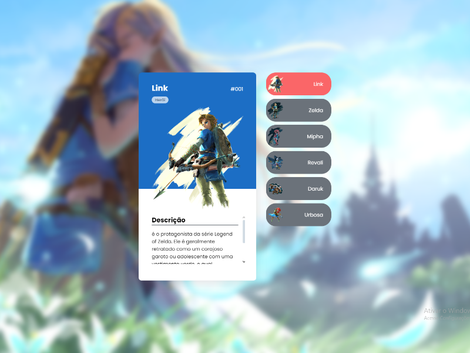

<!DOCTYPE html>
<html lang="en">
<head>
    <meta charset="UTF-8">
    <meta name="viewport" content="width=device-width, initial-scale=1.0">
</head>
<body>
<h1>Projeto:</h1>

 <h2>Referência:</h2>
 
Projeto Original: <a href="https://www.youtube.com/@DevemDobro/streams
    ">Clique aqui</a>

 
</body>
</html>
